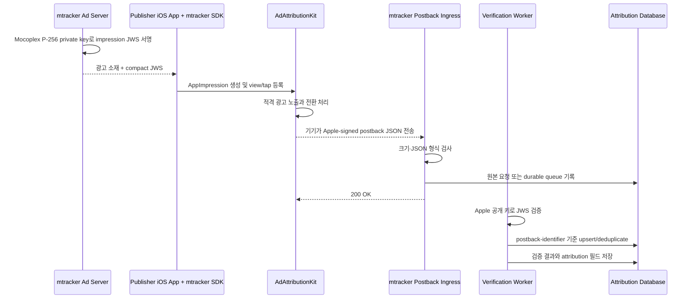

# AdAttributionKit 서버 후속 작업 가이드

> 대상: mtracker 백엔드·인프라·보안·iOS SDK 담당자
> Apple Case-ID: `20861928`
> Ad network ID: `j6h985gljy.adattributionkit`
> 최종 확인일: 2026-07-22
> 상태: Apple enrollment 완료, 운영 연동 활성화 단계

Apple은 2026-07-22 `Case-ID: 20861928`에 대해 공개 키와 포스트백 URL을 승인하고 “Your application is now complete”라고 회신했다. 이 문서는 완료된 enrollment 설정과 광고 노출부터 포스트백 집계까지 연결하는 운영 구현 계약을 정의한다.

## 1. 완료 조건

다음 조건을 모두 만족한 후 Apple에 등록 정보를 회신한다.

- `prime256v1`(NIST P-256) ECDSA 키 쌍을 생성했다.
- 개인 키는 Git, OneDrive, SDK, 컨테이너 이미지 밖의 Secret Manager 또는 KMS/HSM에 저장했다.
- 공개 키가 PEM 형식의 `-----BEGIN PUBLIC KEY-----` 파일이며 P-256 키임을 검증했다.
- 운영 HTTPS POST 엔드포인트를 배포했다.
- 엔드포인트는 인증 헤더, 쿠키 또는 세션 없이 접근 가능하다.
- 엔드포인트에 리다이렉트가 없고 인증서 체인과 호스트명이 유효하다.
- 요청을 영속 큐 또는 데이터베이스에 기록한 뒤 `200 OK`를 반환한다.
- 워커가 Apple JWS의 `alg`, `kid`, 서명, 필수 payload를 검증한다.
- `postback-identifier` 기준 중복 처리가 구현되어 있다.
- 운영 로그, 지표, 경보와 데이터 보존 정책이 적용되어 있다.
- 수동 스모크 테스트와 Apple 개발 모드 종단간 테스트를 통과했다.
- Apple 회신 메일에 `Case-ID: 20861928`을 포함했다.

권장 운영 URL은 다음과 같다.

```text
https://ingest-mtracker.ja0.com/v1/adattributionkit/postbacks
```

이 URL은 Apple에 등록된 운영 계약이다. 2026-07-22 점검에서 POST 전용 라우트(`HEAD` 요청은 `405 Method Not Allowed`, `Allow: POST`)와 TLS가 정상임을 확인했다. URL을 변경하려면 서버를 먼저 배포·검증한 뒤 Apple Enrollment 팀과 등록 변경을 진행한다.

## 2. 전체 처리 흐름



## 3. 두 종류의 서명을 구분한다

AdAttributionKit 흐름에는 서로 반대 방향의 서명이 존재한다.

| 구분 | 서명 주체 | 검증 주체 | 사용하는 키 |
|---|---|---|---|
| 광고 impression JWS | mtracker 광고 서버 | Apple/iOS | Mocoplex 개인 키로 ES256 서명, Apple에 제출한 공개 키로 검증 |
| install/re-engagement postback JWS | Apple | mtracker 서버 | Apple 개인 키로 ES256 서명, Apple 공식 공개 키로 검증 |

Apple에 보내는 것은 **Mocoplex 공개 키뿐**이다. Mocoplex 개인 키와 Apple 공개 키는 목적이 다르며 서로 대체할 수 없다.

## 4. 1단계: Mocoplex 키 생성과 보관

### 4.1 안전한 작업 위치 준비

키는 이 저장소 또는 OneDrive 동기화 폴더에서 생성하지 않는다. 보안 관리 대상 호스트의 비동기화 디렉터리에서 생성한다. 최종 개인 키는 조직의 Secret Manager, Vault, KMS 또는 HSM으로 즉시 이동한다.

Windows에서는 현재 설치된 Git for Windows의 OpenSSL을 사용할 수 있다.

```powershell
& 'C:\Program Files\Git\usr\bin\openssl.exe' version
```

Linux/macOS에서는 시스템 또는 보안팀이 승인한 OpenSSL 바이너리를 사용한다.

```bash
openssl version
```

### 4.2 P-256 키 쌍 생성

Windows PowerShell:

```powershell
& 'C:\Program Files\Git\usr\bin\openssl.exe' ecparam `
  -name prime256v1 `
  -genkey `
  -noout `
  -out mocoplex_adattributionkit_private_key.pem

& 'C:\Program Files\Git\usr\bin\openssl.exe' ec `
  -in mocoplex_adattributionkit_private_key.pem `
  -pubout `
  -out mocoplex_adattributionkit_public_key.pem
```

Linux/macOS:

```bash
openssl ecparam \
  -name prime256v1 \
  -genkey \
  -noout \
  -out mocoplex_adattributionkit_private_key.pem

openssl ec \
  -in mocoplex_adattributionkit_private_key.pem \
  -pubout \
  -out mocoplex_adattributionkit_public_key.pem

chmod 600 mocoplex_adattributionkit_private_key.pem
chmod 644 mocoplex_adattributionkit_public_key.pem
```

Apple은 이 명령으로 생성한 공개 키를 “PEM-encoded PKCS#8 EC public key”로 안내한다. 결과 파일의 시작과 끝은 다음과 같아야 한다.

```text
-----BEGIN PUBLIC KEY-----
...
-----END PUBLIC KEY-----
```

### 4.3 키 검증

Windows PowerShell:

```powershell
& 'C:\Program Files\Git\usr\bin\openssl.exe' pkey `
  -pubin `
  -in mocoplex_adattributionkit_public_key.pem `
  -text `
  -noout

& 'C:\Program Files\Git\usr\bin\openssl.exe' pkey `
  -in mocoplex_adattributionkit_private_key.pem `
  -check `
  -noout

& 'C:\Program Files\Git\usr\bin\openssl.exe' pkey `
  -pubin `
  -in mocoplex_adattributionkit_public_key.pem `
  -outform DER |
  & 'C:\Program Files\Git\usr\bin\openssl.exe' sha256
```

공개 키 출력에서 `prime256v1`, `P-256` 또는 동등한 NIST P-256 식별자를 확인한다. SHA-256 fingerprint는 비밀이 아니므로 배포 티켓과 키 인벤토리에 기록해도 된다.

### 4.4 개인 키 보관 규칙

- 개인 키를 Git commit, CI artifact, Docker image, 로그, Slack, 이메일 또는 클라이언트 SDK에 넣지 않는다.
- 운영 서비스에는 파일 자체보다 Secret Manager/KMS의 런타임 참조를 제공한다.
- Secret 이름 예: `prod/adattributionkit/j6h985gljy/signing-private-key`.
- 읽기 권한은 광고 impression 서명 서비스의 런타임 identity로 제한한다.
- 포스트백 수신·검증 서비스에는 Mocoplex 개인 키 권한을 부여하지 않는다.
- 개발·스테이징·운영 키를 임의로 복제하지 않는다. Apple에 등록한 키를 사용하는 운영 서명 경로를 명확히 분리한다.
- 키 유출이 의심되면 광고 서명을 중단하고 Apple Enrollment/Developer Support와 교체 절차를 먼저 협의한다. 기존 키를 일방적으로 바꾸면 Apple 검증이 실패한다.

## 5. 2단계: 포스트백 ingress 구현

### 5.1 외부 HTTP 계약

```http
POST /v1/adattributionkit/postbacks HTTP/1.1
Host: ingest-mtracker.ja0.com
Content-Type: application/json
```

Apple 문서의 요청 본문 예시는 다음 구조다.

```json
{
  "jws-string": "<compact-JWS>",
  "conversion-value": 24,
  "ad-interaction-type": "click",
  "country-code": "US"
}
```

다음 정책을 적용한다.

- 허용 메서드: `POST`.
- 요청 인증: 없음. Apple이 임의의 SDK API key나 HMAC header를 보낼 것으로 가정하지 않는다.
- 허용 Content-Type: `application/json`; charset 파라미터는 허용한다.
- body 크기 제한: 기본 64 KiB. 운영에서 확인된 최대 크기에 여유를 둔다.
- request timeout: ingress 전체 3~5초 이내를 목표로 한다.
- 리다이렉트: 금지. HTTP→HTTPS 리다이렉트에 기대지 말고 Apple에는 최종 HTTPS URL을 제출한다.
- 응답 body: 비어 있거나 `{"ok":true}`와 같은 고정 응답만 사용한다. 내부 정보는 노출하지 않는다.
- rate limit: IP만으로 Apple 요청을 차단하지 않는다. body limit, queue 보호, WAF 관찰 모드로 시작한다.

### 5.2 권장 응답 정책

빠른 응답과 재처리를 위해 ingress와 검증 worker를 분리한다.

| 상황 | 응답 | 처리 |
|---|---:|---|
| JSON envelope가 정상이고 durable queue/DB 기록 성공 | `200` | 비동기 검증 |
| 같은 raw request 또는 같은 postback 재전송 | `200` | idempotent 처리 |
| body가 너무 큼 | `413` | 기록 없이 거부 |
| JSON 자체가 파싱 불가 또는 `jws-string` 없음 | `400` | 안전한 메타데이터만 기록 |
| queue/DB 장애로 영속 기록 실패 | `500` | Apple 재시도 유도 |
| worker에서 서명 무효 판정 | ingress는 이미 `200` | 집계에서 제외하고 rejected 상태 기록 |

Apple 문서에 따르면 수신 서버가 `500`을 반환하면 기기가 최대 9일 동안 최대 9회 재시도할 수 있다. 따라서 일시적 내부 장애에서만 `500`을 사용하고, 이미 영속 저장한 요청에는 `200`을 반환한다.

### 5.3 프록시와 네트워크 설정

- TLS 인증서는 `ingest-mtracker.ja0.com` 호스트명과 일치해야 한다.
- 전체 인증서 체인을 제공하고 만료 경보를 설정한다.
- CDN/WAF/로드밸런서가 POST body를 제거하거나 재작성하지 않아야 한다.
- `/v1/adattributionkit/postbacks`에는 기존 SDK용 `X-MT-Key`/HMAC middleware를 적용하지 않는다.
- API gateway가 trailing slash를 강제 리다이렉트하지 않도록 exact route와 slash 변형 정책을 명시한다.
- 응답 압축, CORS, 브라우저 쿠키는 필요하지 않다.
- 원본 body 또는 canonical JSON을 검증 완료 전까지 보존한다.

### 5.4 ingress 의사 코드

ingress는 JWS payload를 신뢰하거나 attribution을 계산하지 않는다. 최소 envelope 검사와 영속화만 담당한다.

```text
handlePostback(request):
    if request.bodySize > 64 KiB:
        return 413

    envelope = parseJson(request.rawBody)
    if envelope is invalid or envelope["jws-string"] is not a string:
        return 400

    receiptId = randomUUID()
    bodyHash = sha256(request.rawBody)

    transaction:
        insert inbox(receiptId, encryptedRawBody, bodyHash, receivedAt, "received")
        enqueue verificationJob(receiptId)

    if durable transaction failed:
        return 500

    return 200
```

DB와 queue를 하나의 원자적 transaction으로 묶을 수 없다면 transactional outbox 패턴을 사용한다. DB insert만 성공하고 enqueue가 실패해 요청이 영구 대기 상태가 되는 구간을 만들지 않는다.

## 6. 3단계: Apple JWS 검증

### 6.1 검증 순서

worker는 다음 순서를 지킨다.

1. 외부 JSON에서 `jws-string`을 문자열로 읽는다.
2. compact JWS가 점(`.`)으로 구분된 세 부분인지 확인한다.
3. JOSE header만 제한적으로 decode해 `alg`와 `kid`를 읽는다. 이 단계의 값은 아직 신뢰하지 않는다.
4. `alg`가 정확히 `ES256`인지 확인한다. `none`, `HS256`, 임의 알고리즘은 거부한다.
5. `kid`가 Apple 공식 allowlist에 있는지 확인한다.
6. `kid`에 대응하는 Apple NIST P-256 공개 키를 선택한다.
7. 검증된 JOSE/JWT 라이브러리로 compact JWS 서명을 검증한다.
8. 서명 검증에 성공한 뒤에만 payload를 신뢰하고 스키마 검증을 수행한다.
9. `ad-network-identifier == "j6h985gljy.adattributionkit"`인지 확인한다.
10. `postback-identifier` 기준으로 idempotent insert를 수행한다.
11. `did-win`, `postback-sequence-index`, conversion type 등 집계 규칙을 적용한다.

직접 base64url, ECDSA DER 변환 또는 서명 비교 코드를 구현하지 않는다. JOSE 규격의 ES256 signature는 일반 ASN.1 DER ECDSA 서명과 표현이 다를 수 있으므로, 사용 중인 서버 언어의 검증된 JOSE 라이브러리를 사용한다.

worker 의사 코드:

```text
verifyPostback(receiptId):
    inbox = loadInboxForUpdate(receiptId)
    envelope = parseJson(decrypt(inbox.rawBody))
    compactJws = envelope["jws-string"]

    header = decodeProtectedHeaderWithoutTrust(compactJws)
    if header.alg != "ES256": reject(receiptId, "unsupported_alg")
    if header.kid not in pinnedAppleKeys: reject(receiptId, "unknown_kid")

    payload = joseLibrary.compactVerify(
        compactJws,
        pinnedAppleKeys[header.kid],
        allowedAlgorithms = ["ES256"]
    )

    validatePayloadSchema(payload)
    if payload.adNetworkIdentifier != "j6h985gljy.adattributionkit":
        reject(receiptId, "wrong_ad_network")

    transaction:
        insert verifiedPostback(payload.postbackIdentifier, ...)
        on unique conflict compare existing immutable hashes
        update inbox status to verified, duplicate, or conflict
```

각 `reject` 경로는 inbox 상태와 고정된 rejection reason을 저장하고 정상 종료한다. 예외 message 원문을 외부 응답이나 일반 로그에 노출하지 않는다. 일시적 DB/KMS 오류만 retryable processing error로 분류한다.

### 6.2 Apple key allowlist

Apple은 환경과 생성 방식에 따라 다른 `kid`를 사용한다. 다음 식별자는 2026-07-21 Apple 공식 문서 기준이다.

| 환경 | 허용 `kid` | 운영 집계 |
|---|---|---|
| Production | `apple-cas-identifier/0` | 허용 |
| Development end-to-end | `apple-development-identifier/0` | 개발 데이터로 분리 |
| Developer Settings 생성 | `apple-development-identifier/1` | 개발 데이터로 분리 |

공개 키의 DER Base64 값은 코드 작성 시 Apple의 [Verifying a postback](https://developer.apple.com/documentation/adattributionkit/verifying-a-postback/) 문서에서 다시 확인해 pinning 한다. 검색 결과나 제3자 블로그의 키를 사용하지 않는다. 다음 운영 규칙을 적용한다.

- 운영 환경은 기본적으로 production `kid`만 집계한다.
- development `kid` 요청은 별도 테스트 엔드포인트나 환경 플래그로 격리한다.
- 알 수 없는 `kid`는 외부 네트워크로 자동 key lookup 하지 말고 거부 후 경보한다.
- Apple 문서의 키가 변경되면 코드 리뷰와 이중 승인 후 allowlist를 배포한다.
- 현재 활성 key fingerprint와 배포 버전을 운영 문서에 기록한다.

### 6.3 검증할 signed payload

Apple이 서명한 payload에는 다음 필드가 포함될 수 있다.

| 필드 | 검증 규칙 |
|---|---|
| `postback-identifier` | 필수 UUID 문자열, 전체 시스템 idempotency key |
| `ad-network-identifier` | 정확히 `j6h985gljy.adattributionkit` |
| `impression-type` | 현재 지원하는 값 allowlist, 기본 `app-impression` |
| `advertised-item-identifier` | 필수 양의 정수, 등록 앱/캠페인과 대조 |
| `source-identifier` | 문자열로 보존, 지원 범위와 자릿수 검증 |
| `conversion-type` | `download`, `redownload`, `re-engagement` allowlist |
| `did-win` | Boolean; 성과 집계는 일반적으로 `true`만 사용 |
| `postback-sequence-index` | `0`, `1`, `2` 중 하나 |
| `publisher-item-identifier` | optional 정수 |
| `marketplace-identifier` | optional 문자열 |

필수 필드 누락, 타입 불일치, 알 수 없는 enum 값은 rejected 상태로 기록하고 자동 집계하지 않는다. 원문 보존과 스키마 버전화를 통해 Apple이 필드를 확장했을 때 재처리할 수 있게 한다.

### 6.4 signed와 unsigned 필드

Apple 포스트백은 signed compact JWS와 JWS 밖의 일부 필드 조합이다. 현재 문서 예시에서 `conversion-value`, `coarse-conversion-value`, `ad-interaction-type`, `country-code`는 outer JSON에 나타날 수 있다.

- signed payload와 outer JSON을 별도 컬럼에 저장한다.
- outer 필드를 JWS로 보호된 값이라고 간주하지 않는다.
- billing, 정산 또는 사기 판정에 outer 필드만 단독 사용하지 않는다.
- 유효한 signed payload와 결합된 경우에만 분석용으로 사용한다.
- 동일 `postback-identifier` 재전송이 outer 값을 바꾸더라도 최초 검증 레코드를 무조건 덮어쓰지 않는다. 충돌 상태와 원문 hash를 기록한다.

## 7. 데이터 모델과 idempotency

관계형 데이터베이스 기준 예시다. 실제 스키마 규칙에 맞춰 타입과 이름을 조정한다. 검증 전 요청은 공격자가 만든 `postback-identifier`를 포함할 수 있으므로, 외부 identifier를 inbox primary key로 사용하지 않는다.

```sql
CREATE TABLE adattributionkit_postback_inbox (
    receipt_id                 UUID PRIMARY KEY,
    processing_status          VARCHAR(24) NOT NULL,
    rejection_reason           VARCHAR(64),
    raw_body_encrypted         BYTEA NOT NULL,
    raw_body_sha256            CHAR(64) NOT NULL,
    content_type               VARCHAR(128),
    received_at                TIMESTAMPTZ NOT NULL,
    processing_attempts        INTEGER NOT NULL DEFAULT 0,
    next_attempt_at             TIMESTAMPTZ,
    processed_at               TIMESTAMPTZ,
    created_at                 TIMESTAMPTZ NOT NULL DEFAULT NOW(),
    updated_at                 TIMESTAMPTZ NOT NULL DEFAULT NOW()
);

CREATE INDEX idx_aak_inbox_processing
    ON adattributionkit_postback_inbox
       (processing_status, next_attempt_at, received_at);

CREATE TABLE adattributionkit_postbacks (
    postback_identifier       UUID PRIMARY KEY,
    environment               VARCHAR(16) NOT NULL,
    apple_key_id              VARCHAR(128) NOT NULL,
    ad_network_identifier     VARCHAR(128),
    advertised_item_id        BIGINT,
    publisher_item_id         BIGINT,
    marketplace_identifier    VARCHAR(255),
    impression_type           VARCHAR(64),
    source_identifier         VARCHAR(16),
    conversion_type           VARCHAR(32),
    did_win                   BOOLEAN,
    postback_sequence_index   SMALLINT,
    conversion_value          SMALLINT,
    coarse_conversion_value   VARCHAR(16),
    ad_interaction_type       VARCHAR(16),
    country_code              CHAR(2),
    compact_jws_encrypted     BYTEA NOT NULL,
    signed_payload_json       JSONB NOT NULL,
    outer_payload_json        JSONB NOT NULL,
    raw_body_sha256           CHAR(64) NOT NULL,
    first_receipt_id          UUID NOT NULL REFERENCES adattributionkit_postback_inbox(receipt_id),
    received_at               TIMESTAMPTZ NOT NULL,
    verified_at               TIMESTAMPTZ NOT NULL,
    created_at                TIMESTAMPTZ NOT NULL DEFAULT NOW(),
    updated_at                TIMESTAMPTZ NOT NULL DEFAULT NOW()
);

CREATE INDEX idx_aak_postbacks_received_at
    ON adattributionkit_postbacks (received_at);

CREATE INDEX idx_aak_postbacks_campaign
    ON adattributionkit_postbacks
       (advertised_item_id, source_identifier, received_at);
```

권장 상태 값:

- `received`: ingress 영속화 완료, 검증 대기.
- `processing`: worker가 lease를 획득해 처리 중.
- `verified`: Apple JWS와 payload 검증 성공.
- `rejected`: 서명 또는 스키마 검증 실패.
- `duplicate`: 기존 `postback-identifier`와 동일하고 hash도 일치.
- `conflict`: 같은 identifier지만 raw hash 또는 immutable payload가 다름.
- `processing_error`: 일시적 worker 오류로 backoff 재처리 대상.

민감정보와 개인정보 정책에 맞게 원문 보존 기간을 정한다. IP 주소가 필요하지 않다면 저장하지 않고, 운영 보안 목적으로 필요하면 salt가 있는 hash 또는 제한된 보안 로그에만 보존한다.

## 8. 광고 서버의 impression JWS 생성

포스트백 수신만 구현하면 attribution 흐름이 완성되지 않는다. 광고 서버는 Apple에 등록한 Mocoplex 개인 키로 각 광고 impression의 compact JWS를 생성해야 한다.

### 8.1 JOSE header

```json
{
  "alg": "ES256",
  "kid": "j6h985gljy.adattributionkit"
}
```

재참여 기능을 사용할 경우 현재 Apple의 [Generating JWS impressions](https://developer.apple.com/documentation/adattributionkit/generating-jws-impressions/) 스키마에 맞춰 `eligible-for-re-engagement` 필드를 설정한다.

### 8.2 impression payload 예시

```json
{
  "impression-identifier": "7aa9f8cc-5689-4c02-b963-22ca22136015",
  "publisher-item-identifier": 1234567890,
  "impression-type": "app-impression",
  "ad-network-identifier": "j6h985gljy.adattributionkit",
  "source-identifier": 5239,
  "timestamp": 1784600000000,
  "advertised-item-identifier": 9876543210
}
```

구현 규칙:

- `impression-identifier`: impression마다 새 UUID를 생성하고 재사용하지 않는다.
- `timestamp`: UTC Unix epoch milliseconds를 사용한다.
- `publisher-item-identifier`: 광고를 보여주는 앱의 App Store item ID다.
- `advertised-item-identifier`: 광고 대상 앱의 App Store item ID다.
- `source-identifier`: 캠페인 매핑 규칙을 중앙 관리하고 사후 변경 이력을 보존한다.
- header와 payload를 임의의 공백/키 순서에 의존하지 않고 JOSE 라이브러리로 compact JWS 처리한다.
- 개인 키를 매 요청마다 파일에서 읽지 말고, 제한된 런타임 secret/KMS signer를 사용한다.
- 서명 실패 시 unsigned 광고를 AdAttributionKit 광고인 것처럼 내려주지 않는다.
- compact JWS 전체 또는 개인 키 내용을 일반 application log에 남기지 않는다.

### 8.3 광고 API 응답 계약 제안

기존 `POST https://ad-mtracker.ja0.com/v1/ad` 응답에 다음 필드를 추가한다.

```json
{
  "adId": "ad_123",
  "slotId": "home_feed_slot",
  "format": "native",
  "assets": {},
  "tracking": {},
  "attribution": {
    "provider": "adattributionkit",
    "compactJWS": "eyJraWQiOi..."
  }
}
```

서버와 SDK를 독립 배포할 수 있도록 `attribution`은 초기에는 optional로 추가한다. 지원 SDK 버전과 iOS 버전에서만 사용하며, 알 수 없는 필드를 무시하는 기존 클라이언트 호환성을 확인한다.

현재 iOS SDK의 `NativeAd` 모델과 `MTNativeAdView`에는 `compactJWS`/`AppImpression` 처리가 없으므로 서버 응답 변경과 함께 SDK 작업이 필요하다.

## 9. 퍼블리셔 앱과 iOS SDK 연결 계약

서버 담당자는 다음 클라이언트 선행조건을 iOS 담당자와 함께 확인한다.

- 광고를 표시하는 앱의 `Info.plist`에 `AdNetworkIdentifiers` 배열을 추가한다.
- 배열 값에 소문자 `j6h985gljy.adattributionkit`을 넣는다.
- 기존 SKAdNetwork의 `SKAdNetworkItems`와 AdAttributionKit의 `AdNetworkIdentifiers`를 혼용하지 않는다.
- iOS SDK는 서버의 `compactJWS`로 `AppImpression`을 생성한다.
- view-through는 Apple API가 요구하는 노출 시간과 호출 순서를 지킨다.
- click-through는 `UIEventAttributionView` 및 `handleTap` 요구사항을 따른다.
- advertised app은 첫 실행 시 `Postback.updateConversionValue`를 한 번 이상 호출한다.
- 개발 모드 데이터는 운영 집계와 분리한다.

`Info.plist` 예시:

```xml
<key>AdNetworkIdentifiers</key>
<array>
    <string>j6h985gljy.adattributionkit</string>
</array>
```

## 10. 테스트 계획

### 10.1 정적 키 검사

- 공개 키 PEM header/footer 확인.
- 공개 키 curve가 P-256인지 확인.
- 개인 키 `openssl pkey -check` 성공 확인.
- 개인 키에서 다시 생성한 공개 키 fingerprint가 Apple 제출 파일과 같은지 확인.
- 개인 키 파일이 `git status`, CI artifact, 컨테이너 layer에 나타나지 않는지 확인.

### 10.2 TLS와 라우팅 검사

```bash
curl -v --http1.1 \
  https://ingest-mtracker.ja0.com/v1/adattributionkit/postbacks
```

GET이 `404` 또는 `405`여도 POST가 정상일 수 있다. 최종 판정은 다음 POST 스모크 테스트로 한다.

```bash
curl -i \
  -X POST \
  -H 'Content-Type: application/json' \
  --data '{"jws-string":"invalid.test.signature"}' \
  https://ingest-mtracker.ja0.com/v1/adattributionkit/postbacks
```

비운영 mock JWS 테스트에서 확인할 항목:

- ingress가 요청을 안전하게 영속화한다.
- 응답 정책에 맞는 HTTP 상태를 반환한다.
- worker가 `alg`/`kid`/서명 오류로 rejected 처리한다.
- raw JWS나 body가 일반 로그에 그대로 출력되지 않는다.
- rejected 요청이 attribution 통계에 포함되지 않는다.

### 10.3 자동 테스트 케이스

- Apple 문서의 development sample JWS가 대응하는 development key로 검증됨.
- 테스트 전용 P-256 키로 생성한 ES256 fixture가 일반 verifier 단위 테스트를 통과함.
- `alg=none`, `HS256`, 알 수 없는 `alg` 거부.
- 알 수 없는 `kid` 거부.
- payload 한 글자 변조 시 서명 실패.
- 서명 한 글자 변조 시 실패.
- 다른 ad network identifier 거부.
- 필수 필드 누락과 타입 오류 거부.
- 동일 postback identifier 두 번 수신 시 한 번만 집계.
- 동일 identifier, 다른 raw body면 conflict 기록.
- sequence index 0, 1, 2 허용; 그 외 거부.
- development key 데이터가 production 집계에 포함되지 않음.
- queue 장애 시 `500`, 복구 후 재전송은 한 번만 처리.
- 64 KiB 초과 body `413`.

테스트 fixture는 개인 키를 포함하지 않고, 테스트 전용 키 또는 Apple 공식 개발 fixture만 사용한다.

### 10.4 Apple 개발 모드 종단간 테스트

1. 지원 iOS 기기에서 Developer Mode와 AdAttributionKit 개발 기능을 활성화한다.
2. development impression JWS 또는 Apple이 제공하는 개발 흐름을 사용한다.
3. publisher 앱에서 실제 광고 view/tap을 등록한다.
4. advertised 앱을 열고 conversion value를 갱신한다.
5. Apple 개발 포스트백을 생성하거나 가속된 전달을 기다린다.
6. ingress 수신 시각, `kid`, 검증 결과, 저장 레코드를 확인한다.
7. development 데이터가 운영 dashboard/정산에서 제외되는지 확인한다.

개발 테스트 절차는 배포 시점의 Apple [AdAttributionKit 문서](https://developer.apple.com/documentation/adattributionkit)를 다시 확인한다.

## 11. 관측성 및 운영 경보

최소 지표:

- `adattributionkit_postback_requests_total{http_status}`
- `adattributionkit_postback_verify_total{status,environment,reason}`
- `adattributionkit_postback_duplicates_total`
- `adattributionkit_postback_conflicts_total`
- `adattributionkit_postback_queue_lag_seconds`
- `adattributionkit_postback_processing_seconds`
- `adattributionkit_postback_unknown_kid_total`
- `adattributionkit_postback_valid_wins_total{conversion_type,sequence_index}`

경보 예시:

- 5xx 비율이 5분 동안 1% 초과.
- queue lag가 10분 초과.
- production 트래픽에서 unknown `kid`가 1건 이상 발생.
- verified 비율이 평소 대비 급락.
- certificate 만료 30/14/7일 전.
- 포스트백이 예상 캠페인 운영 중 24시간 이상 0건. 단, Apple privacy threshold와 전달 지연을 고려해 오탐 여부를 확인한다.

로그에는 request ID, 수신 시각, body hash, `kid`, environment, verification status, rejection reason만 기본 기록한다. compact JWS와 전체 payload는 접근 통제된 저장소에서만 조회한다.

## 12. 배포 순서

현재 1~6단계와 Apple enrollment가 완료됐다. 승인 후 활성화 작업인 7~10단계를 진행한다.

1. DB migration과 queue topic을 먼저 배포한다.
2. worker를 비집계 shadow mode로 배포한다.
3. ingress exact route를 배포한다.
4. TLS, POST, queue, worker rejection 스모크 테스트를 수행한다.
5. 운영 Apple 공개 키 allowlist를 이중 검토한다.
6. Apple에 Mocoplex 공개 키와 최종 URL을 회신한다.
7. Apple 승인/활성화 확인 후 ad server impression JWS를 제한된 캠페인에 활성화한다.
8. iOS SDK에서 `AppImpression` 경로를 feature flag로 활성화한다.
9. 개발 모드 종단간 테스트 후 소규모 운영 캠페인으로 canary 배포한다.
10. 검증률, unknown key, duplicate/conflict, conversion 흐름을 확인하고 확대한다.

## 13. Apple 회신 템플릿

공개 키와 URL이 실제로 검증된 후 다음 형식으로 기존 이메일 thread에 회신한다. 개인 키는 첨부하거나 붙여 넣지 않는다.

```text
Case-ID: 20861928

Hi AdAttributionKit Enrollment Team,

Thank you for initiating our AdAttributionKit access request.

Please find our enrollment information below:

Ad network ID:
j6h985gljy.adattributionkit

PKCS#8 EC public key (prime256v1):
-----BEGIN PUBLIC KEY-----
<INSERT THE VALIDATED PUBLIC KEY>
-----END PUBLIC KEY-----

AdAttributionKit install validation postback URL:
https://ingest-mtracker.ja0.com/v1/adattributionkit/postbacks

Please let us know if any additional information is required.

Best regards,
Nara Park
Mocoplex, Inc.
```

## 14. 최종 체크리스트

### 보안

- [ ] P-256 개인 키가 Secret Manager/KMS/HSM에 있다.
- [ ] 공개 키 fingerprint가 변경 관리 티켓에 기록됐다.
- [ ] 개인 키가 Git/OneDrive/CI artifact/image/log에 없다.
- [ ] ad server만 개인 키 사용 권한이 있다.
- [ ] postback worker는 Apple 공개 키만 가진다.

### 서버

- [ ] `POST /v1/adattributionkit/postbacks`가 인증 없이 동작한다.
- [ ] HTTPS 인증서, chain, hostname이 유효하다.
- [ ] 리다이렉트가 없다.
- [ ] 요청이 durable storage에 기록된 후 `200`을 반환한다.
- [ ] JWS `alg`/`kid`/서명/payload를 검증한다.
- [ ] production/development 데이터를 분리한다.
- [ ] `postback-identifier` idempotency가 보장된다.
- [ ] `did-win`과 sequence index가 올바르게 집계된다.
- [ ] 5xx, queue lag, unknown key 경보가 있다.

### 광고 서버·SDK

- [ ] ad server가 ES256 compact impression JWS를 생성한다.
- [ ] JWS `kid`가 `j6h985gljy.adattributionkit`이다.
- [ ] 광고 API 응답에 optional `attribution.compactJWS`가 있다.
- [ ] iOS SDK가 `AppImpression` view/tap 흐름을 구현했다.
- [ ] publisher 앱이 `AdNetworkIdentifiers`를 포함한다.
- [ ] advertised 앱이 첫 실행 시 conversion value를 업데이트한다.

### Apple 회신

- [ ] 제출 공개 키가 실제 운영 서명 개인 키와 한 쌍이다.
- [ ] 제출 URL이 실제 운영 POST 테스트를 통과했다.
- [ ] 회신 본문에 `Case-ID: 20861928`이 있다.
- [ ] 공개 키만 전달하고 개인 키는 전달하지 않았다.

## 15. 공식 참고 자료

- [Registering an ad network](https://developer.apple.com/documentation/adattributionkit/registering-an-ad-network/)
- [Generating JWS impressions](https://developer.apple.com/documentation/adattributionkit/generating-jws-impressions/)
- [Verifying a postback](https://developer.apple.com/documentation/adattributionkit/verifying-a-postback/)
- [Identifying the parameters in a postback](https://developer.apple.com/documentation/adattributionkit/identifying-the-parameters-in-a-postback/)
- [Configuring a publisher app](https://developer.apple.com/documentation/adattributionkit/configuring-a-publisher-app/)
- [Configuring an advertised app](https://developer.apple.com/documentation/adattributionkit/configuring-an-advertised-app/)
- [AdAttributionKit framework](https://developer.apple.com/documentation/adattributionkit/)
